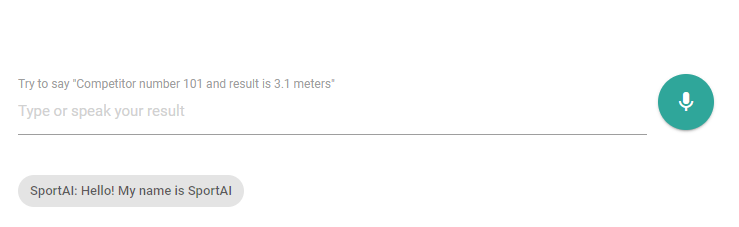

# SportAI - Chatbot based on Dialogflow 
SportAI. Small demo of using HTML5 Speech API and Dialogflow for parsing sport results from user sentence.

##Artificial Intelligence is here for everyone
Lately I have been research quite of machine learning, artificial intelligence around natural language processing. One day I told to my colleagues that I bought Google Home Mini and that I am going to integrate it to my home automation platform. This started interesting discussing, ”what you are going to do with it?, why do you need it? etc”. Then we discussed about speech recognition and where that could be used.

## Finding real life use case for speech recognition
One of the colleague is working as a volunteer official on track and field events where results are registered to paper and additionally digitally. Digital results are shown live spectators from screen and web at the real time. He thrown the idea that would be quite neat to just say results to application and then results are booked to digital and shown at screen and web.

## From idea to mock up - SportAI
I did some fast exploring from internet and found some good examples and documents how his idea could be achieved. Like everyone today, I copy & paste some lines of code, put them together during few nights and BAM! Here is the mockup of SportAI where user can write or spell results for each competitor.

Why not try by yourself and give a shout? You need to enable and give permission to microphone and most probably this works only with modern browser like Google Chrome.
You can find demo from here: https://sportsai.glitch.me/

## Was this really artificial intelligence??

Where was artificial intelligence, this doesn't look of artifact intelligence, right? But I think that was the best part, everything will happen on background. When user give input either by speech or writing text, this input is send to Google machine learning for processing. In machine learning I have build and teach very simple bot to process input and trying to find two things from user sentence. Two mandatory entities to find are competitor number and result, service then responds back to application with parsed structured way. This is then reflected to user.

Where you would like to use and see artificial intelligence and machine learning?

### Credits
This whole demo is based on Patrick Catanzariti code and example what you can find from here: https://www.sitepoint.com/how-to-build-your-own-ai-assistant-using-api-ai/
